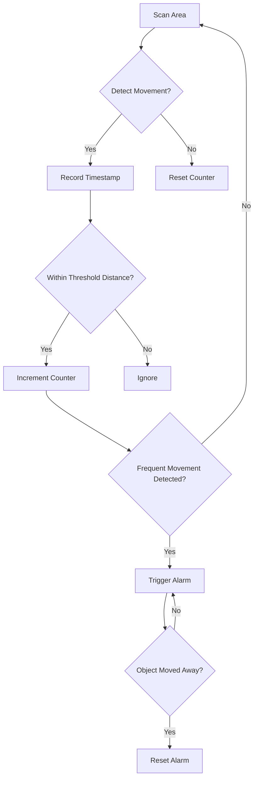

# 🐦‍🔥🐦‍🔥 # Radar Guard System - AI-Based Movement Detection

  

An intelligent radar security system that detects frequent movements within a monitored area using ultrasonic sensing and servo scanning, with AI-based pattern recognition to reduce false alarms.

## Features

- **AI-Powered Detection**
  - Smart movement pattern analysis
  - Configurable sensitivity (distance and frequency thresholds)
  - Reduced false positives through intelligent filtering

- **360° Radar Scanning**
  - Servo-controlled ultrasonic sensor (0-180° sweep)
  - Real-time angle and distance monitoring
  - Adjustable scanning speed and resolution

- **Multi-Channel Alert System**
  - Visual indicators (LEDs)
  - Audible alarm (buzzer)
  - LCD display with detailed alerts
  - Status display when area is clear

## Hardware Components

1. Arduino Uno/Nano
2. HC-SR04 Ultrasonic Sensor
3. SG90 Micro Servo Motor
4. 16x2 I2C LCD Display
5. Red and Green LEDs
6. Passive Buzzer
7. Breadboard and jumper wires
8. 5V Power Supply

## Circuit Diagram

)

### Pin Connections:
- **Servo**: Pin 12
- **Ultrasonic**: Trig(11), Echo(10)
- **LEDs**: Red(3), Green(4)
- **Buzzer**: Pin 2
- **LCD**: I2C (SDA-A4, SCL-A5)

## Installation

1. **Hardware Setup**
   - Connect components as shown in circuit diagram
   - Ensure servo is properly mounted for 180° sweep
   - Position ultrasonic sensor to face forward from servo

2. **Software Setup**
   - Install required libraries:
     ```arduino
     #include <Servo.h>
     #include <Wire.h>
     #include <LiquidCrystal_I2C.h>
     ```
   - Upload the provided code to Arduino

3. **Configuration**
   Adjust these parameters in the code as needed:
   ```arduino
   const int alertDistance = 30;          // Detection range (cm)
   const int distanceThreshold = 3;       // Minimum movement to detect (cm)
   const unsigned long movementThresholdTime = 300; // Time window for frequent movement (ms)
   const int frequentMovementCount = 2;   // Movements needed to trigger alarm
   ```

## Usage

1. Power on the system
2. LCD will display "Area is Empty" during normal operation
3. System will automatically:
   - Continuously scan the area (0-180° sweep)
   - Detect and analyze movements
   - Trigger alarms only for frequent movements within alert distance
   - Provide visual and audible alerts when threat is detected
   - Display "Foreign Body" alert on LCD during detection

## AI Detection Logic



Key Detection Parameters:
- Movement must be ≥ `distanceThreshold` cm
- Must occur ≥ `frequentMovementCount` times
- Within `movementThresholdTime` milliseconds
- Within `alertDistance` cm range

## Customization Options

1. **Detection Sensitivity**
   - Adjust `distanceThreshold` for movement sensitivity
   - Modify `frequentMovementCount` for required detection frequency

2. **Alert Behavior**
   - Change buzzer frequency and pattern
   - Modify LED blink intervals
   - Customize LCD alert messages

3. **Scanning Parameters**
   - Adjust servo speed via `updateInterval`
   - Change scanning angle range (currently 0-180°)

## Troubleshooting

- **Servo jitter**: Ensure stable power supply
- **Inconsistent readings**: Check ultrasonic sensor alignment
- **LCD not working**: Verify I2C address (try 0x27 or 0x3F)
- **False alarms**: Adjust detection thresholds in code

## License

MIT License - Free for personal and educational use

## Future Enhancements

- Add wireless notification (Bluetooth/WiFi)
- Implement logging to SD card
- Add camera integration for visual confirmation
- Develop mobile app for remote monitoring

🤝Connect with Me

Have questions about this project, or are you working on your own exciting Arduino endeavors? 
Feel free to connect or DM me on LinkedIn! 
Name - [Muhammad Taha](https://twitter.com/yourtwitter) - toaha155@gmail.com

Linkedin: [https://www.linkedin.com/in/muhammad-taha101/](https://www.linkedin.com/in/muhammad-taha101/)

I'm always happy to discuss embedded systems, IoT, and innovative tech solutions
